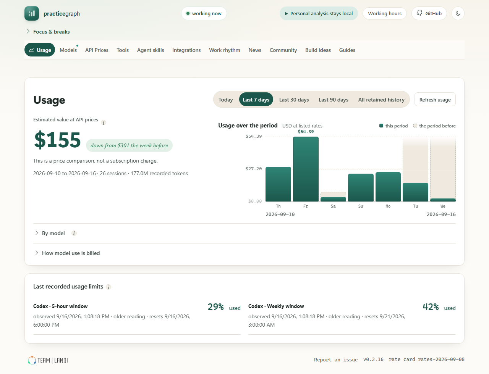
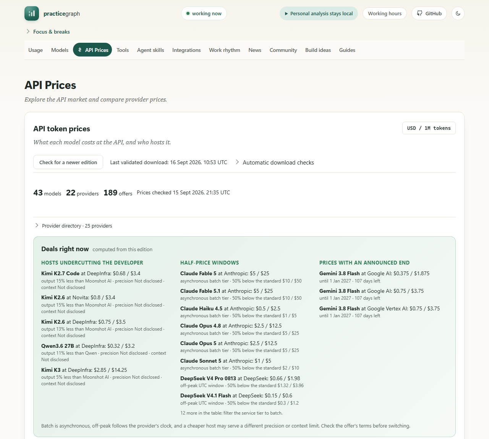

<p align="center">
  
</p>

<h1 align="center">PracticeGraph</h1>

<p align="center">
  <strong>See your AI practice clearly.</strong><br>
  A private daily reading of your work with Claude Code and Codex: what it costs, how you work, and what is worth changing. Computed on your machine. Nothing is sent anywhere.
</p>

<p align="center">
  <a href="LICENSE"></a>
  <a href="https://github.com/TeamLandiLTD/practicegraph-app/releases/latest"></a>
  <a href="https://github.com/TeamLandiLTD/practicegraph-app/actions/workflows/ci.yml"></a>
  
  
  
</p>

<p align="center">
  <a href="#install">Install</a> ·
  <a href="#what-the-app-shows">What the app shows</a> ·
  <a href="#privacy">Privacy</a> ·
  <a href="#documentation">Documentation</a> ·
  <a href="#development">Development</a> ·
  <a href="#contributing">Contributing</a> ·
  <a href="https://practicegraph.dev">practicegraph.dev</a>
</p>

---

PracticeGraph reads the session logs your AI coding tools already keep and turns them into one page a day: estimated spend at listed API prices, the models and capabilities you actually reach for, the rhythm of the work, and a small hand-curated edition of what happened in AI that day. It compares you only with your own past. There are no scores of you, no streaks, no badges.

It is free and open source under Apache-2.0. No account, no trial clock, no license key. Your AI provider subscriptions are separate costs.

## Install

### Windows

1. Download `PracticeGraph-<version>.msi` from the [latest release](https://github.com/TeamLandiLTD/practicegraph-app/releases/latest).
2. Run it. The install is per-user and needs no administrator rights. It uses Microsoft WebView2, which is present on current Windows 10 and 11; the installer tells you if it is missing.
3. Open PracticeGraph from the Start menu. A tray icon keeps the readings fresh about every 15 minutes while it runs.

Installers are signed with TeamLandi's publicly trusted code-signing certificate and timestamped, so the installer names TeamLandi OOD as the publisher. SmartScreen may still ask once while the publisher's download reputation builds. Verify the download against `SHA256SUMS.txt` published with the release.

### macOS

1. Download `PracticeGraph-<version>-macos-arm64.pkg` (an installer wizard) or the `.dmg` from the [latest release](https://github.com/TeamLandiLTD/practicegraph-app/releases/latest). Apple silicon, macOS 13 or later.
2. Run it. The app is signed with a Developer ID and notarized. Upgrading over a running PracticeGraph keeps your history and settings; the installer offers a background refresh that keeps model guidance and prices current while the app is closed.

The Windows and macOS builds do not always share a version number; each release says which version it carries for each platform.

### Linux

A native GTK shell with an Ubuntu 24.04 package builds from this repository and passes CI as a candidate, but signed downloads are not published yet. See [Linux](docs/LINUX_BUILD.md).

### Supported sources

| Tool | What is read | Where |
| --- | --- | --- |
| Claude Code CLI | Session transcripts (parent and subagent transcripts deduplicated) | `~/.claude/projects`, `~/.config/claude/projects`, `CLAUDE_CONFIG_DIR` |
| OpenAI Codex CLI | Rollout logs and archived sessions | `~/.codex/sessions`, honoring `CODEX_HOME` |
| Claude Desktop (macOS) | Embedded coding sessions | `~/Library/Application Support/Claude/…/.claude/projects` |

Parsers keep counters and presence flags only. Prompt and response text never reaches the store.

## What the app shows

One window, one row of pages. Every page opens with a plain-language line about what its numbers mean, and a dot marks a page where something changed since you last looked.

**Usage.** The period's estimated value at listed API prices, compared with your own previous period, with a day-by-day chart, the model breakdown, unpriced turns called out, and the last recorded usage limits. Subscription users see the API-equivalent of their usage, which is a price comparison, not their bill.

**Models.** What each harness runs by default, the reasoning setting in use, and what your sessions actually ran.

**API Prices.** The API market as one row per model: the developer's own price as the headline, every priced host behind an expander, and a computed flag wherever a direct host undercuts the developer on both input and output. A deals panel lists batch and off-peak tiers at half price and prices with an announced end date.

<p align="center"></p>

**Tools, Agent skills, Integrations.** The installed version of each CLI against its latest release, every capability your sessions reached for in the last 30 days with its count, the skills installed for each client with their stated purpose, and every MCP server or plugin your configs declare with how often it was actually called, including the honest zero.

**Work rhythm.** Waiting time, follow-ups and approvals, session tails, late-hour patterns and the work mix, read from timing alone. Observations describe recorded behavior. They are not health assessments.

**Focus and breaks.** A 90-minute focus block, a 10-minute movement break and a 25-minute rest, one click each. During a break the page dims and a guided panel takes over, with instructions that push the break away from the screen.

**News, Community, Build ideas, Guides.** Three news picks a day chosen by hand from twenty to thirty candidates, a practitioner edition of what others measured, one buildable API idea per card, and the official training and certification links for each tool. Editions are downloaded as validated JSON and cached for offline reading.

Estimated figures are marked as such throughout. A figure the app cannot support is withheld with its reason, never shown as zero.

## Privacy

- Everything is computed on your machine from logs your tools already write. The app has no upload path for usage, logs or telemetry.
- Outbound traffic is read-only: published rate cards, curated editions and release tags, each schema-validated and failing closed. The hosts see ordinary HTTP metadata, never your activity.
- Aggregate sharing to an optional self-hosted server is off by default, gated behind explicit consent, and limited to a closed anonymous schema. Optional provider-based wording is a separate, disclosed data flow.
- The dashboard is served on loopback behind a per-session token. Uninstalling removes the app and never your data.

The full boundary, what each command does and does not read, and how to verify it are in [Privacy](docs/PRIVACY.md).

## How it works

```
Claude Code / Codex logs ──▶ parsers (counters, presence flags) ──▶ local SQLite store
                                                                       │
        tray / menu-bar shell ──▶ Python engine (deterministic analysis) ◀┘
                  │                          │
                  ▼                          ▼
        native window (WebView2 / WKWebView / WebKitGTK) ◀── local UI server ── React dashboard
```

The engine is a Python 3.14 package with a standard-library core; identical inputs give byte-identical output, which the golden tests pin. The shells are thin native binaries (Rust on Windows, Swift on macOS, GTK on Linux) that schedule the engine and host the dashboard in a native window. See [Architecture](ARCHITECTURE.md) and the [product principles](PRINCIPLES.md) that every feature is held to.

## Updates

The installed app checks this repository's latest release once a day and shows a notice in the app, and one native toast per newer version outside your quiet hours. It never downloads or installs on its own. Release manifests are Ed25519-signed; see [Releasing](docs/RELEASING.md).

## Documentation

| I want to… | Read |
| --- | --- |
| Install, upgrade, uninstall, or find my data directory | [Install](docs/INSTALL.md) |
| Understand what leaves my machine and what never does | [Privacy](docs/PRIVACY.md) |
| Find my way around the pages and their addresses | [Reading and navigation](docs/UI_NAVIGATION.md) |
| Understand the Usage numbers and their provenance | [Understanding Usage](docs/USAGE_EVIDENCE.md) |
| Understand the API Prices page and the cheaper-host rule | [Token price tracker](docs/TOKEN_PRICES.md) |
| Keep a private practice history or learning path | [Practice history](docs/PRACTICE_TIME.md) · [Learning paths](docs/TRAINING.md) |
| Fix a problem | [Troubleshooting](docs/TROUBLESHOOTING.md) · [FAQ](docs/FAQ.md) |
| Build from source on Windows, macOS or Linux | [Install](docs/INSTALL.md#build-from-source) · [Linux](docs/LINUX_BUILD.md) · [macOS](docs/MACOS_BUILD.md) |
| Understand the design and its invariants | [Architecture](ARCHITECTURE.md) · [Principles](PRINCIPLES.md) |
| See the JSON editions the app reads and how they are verified | [Content formats](docs/CONTENT_FORMATS.md) · [Hosted content](docs/HOSTED_CONTENT.md) · [Catalog encryption](docs/CATALOG_ENCRYPTION.md) |
| Run the optional aggregate server for a team | [Server operations](docs/SERVER_OPS.md) |
| Release, sign and verify builds | [Releasing](docs/RELEASING.md) · [Supply chain](docs/SUPPLY_CHAIN.md) · [Code signing](docs/CODE_SIGNING.md) |
| See what changed | [Changelog](CHANGELOG.md) · [Releases](https://github.com/TeamLandiLTD/practicegraph-app/releases) |

The [documentation index](docs/README.md) lists everything.

## Development

Python 3.14 and Node.js 22 or later.

```bash
python -m venv .venv
. .venv/bin/activate            # Windows: .venv\Scripts\activate
python -m pip install -e ".[dev]"

practicegraph init              # local data directory and store
practicegraph ui serve --open   # the dashboard, served from the built bundle
practicegraph agent run --once  # one scheduler tick
practicegraph doctor            # install health as closed JSON
```

The repository includes a built dashboard. For UI work, run `npm ci`, `npm test` and `npm run build` in `ui/`, and commit the rebuilt `webui/` with your change. Quality gates before any change lands:

```bash
python -m ruff check src tests
python -m mypy
python -m pytest
```

Golden files pin the rendered reports byte-for-byte; regenerate them with `python tests/regen_goldens.py` and review the diff like an API change. Native packaging is documented in [packaging/README.md](packaging/README.md).

## Contributing

Issues and pull requests are welcome. Start with a small issue that describes the user-visible problem, or a focused fix with what changed, why, and how you checked it. Use synthetic fixtures only; never attach real logs, prompts, tokens or private paths. The [contributing guide](CONTRIBUTING.md) has the details, [SECURITY.md](SECURITY.md) explains how to report a vulnerability privately, and the [code of conduct](CODE_OF_CONDUCT.md) applies everywhere in this project.

- [Report a bug](https://github.com/TeamLandiLTD/practicegraph-app/issues/new?template=bug_report.yml)
- [Suggest an idea](https://github.com/TeamLandiLTD/practicegraph-app/issues/new?template=idea.yml)
- [Get help](SUPPORT.md)

## License

Apache-2.0. See [LICENSE](LICENSE) and [NOTICE](NOTICE). PracticeGraph is provided as is, without warranty of any kind, and its authors accept no liability for its use or for anything it reads or writes on your machine; sections 7 and 8 of the licence say so in full. It runs entirely on your computer and writes only to its own data directory, and you decide which logs it may read. The hand-curated editions served to the app are published separately under their own content terms; forks can point the app at another compatible catalog host. PracticeGraph is made by [Team Landi](https://teamlandi.com).
