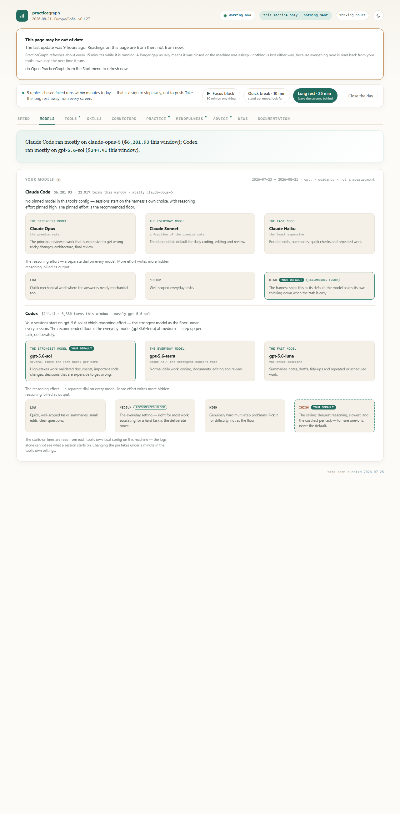
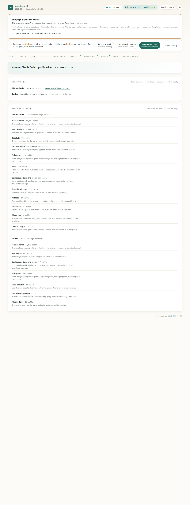
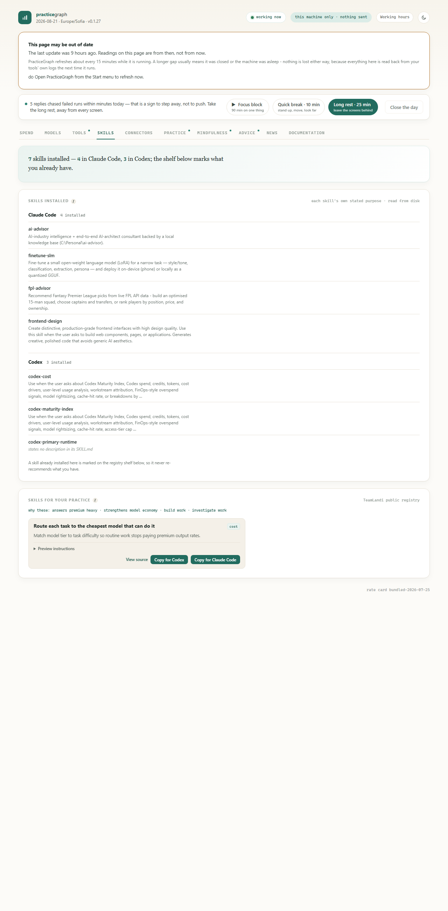
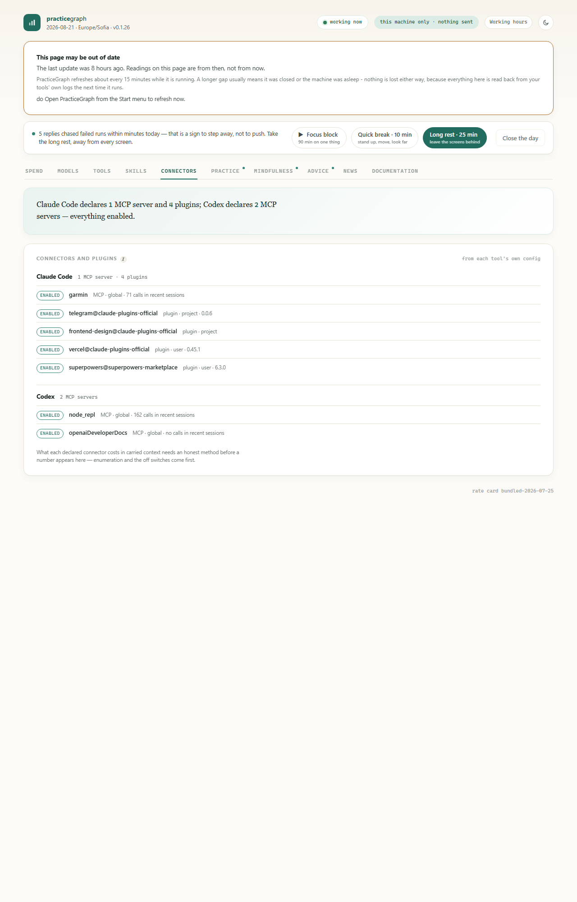
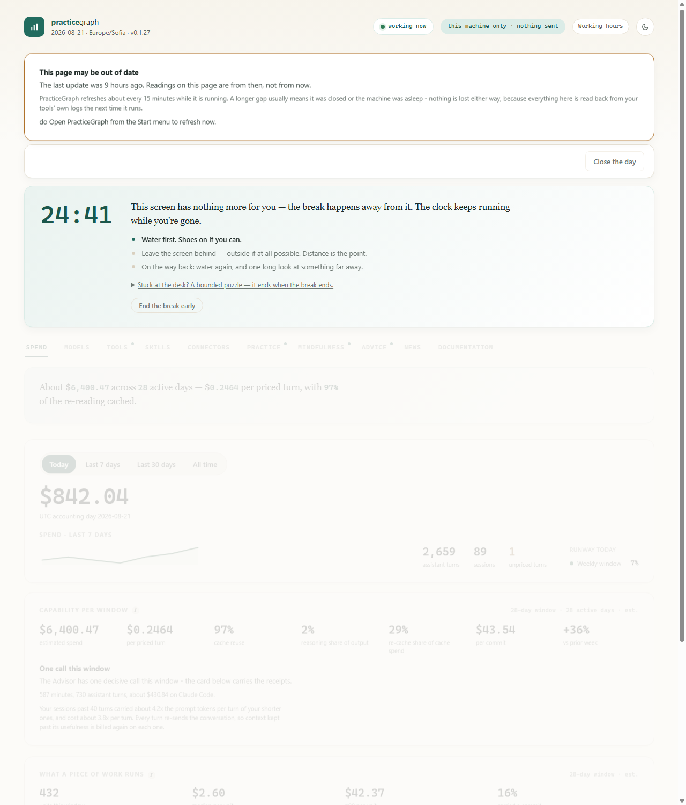

# PracticeGraph

PracticeGraph is a behavioral mirror for people who work with AI coding
agents. It reads the session logs that Claude Code and Codex already keep on
your machine, computes everything locally, and shows you what your practice
actually looks like — what the work costs, which models carry it, which
capabilities of each harness you actually reach for, and what the pace of it
is doing to your attention. Nothing is sent anywhere. The page is a reading
of your own logs, not a score of you.

This repository distributes the installable builds. The source lives in
[Practice-graph](https://github.com/TeamLandiLTD/Practice-graph) (private).

---

## What the app shows

One window, eleven categories behind one navigation rail. Every section opens
with a plain-language summary of what its numbers say; a dot on a category
means something new arrived since you last looked.

**Spend** — what the work cost today and over your windows: per priced turn,
cache reuse, what a piece of work runs, cost per commit.

**Models** — the models available on each harness and what each is for, the
reasoning-effort dial with your pinned default marked against the
recommended floor, and what your sessions actually ran.



**Tools** — what the harnesses are and do: the installed version of each CLI
against the latest published release on the channel you run (stable or
prerelease), and every capability your sessions
reached for in the last 30 days — subagents, web research, plan mode, skills
— each with a line of documentation and its invocation count.



**Skills** — the skills installed for each client, each described by its own
stated purpose, beside a registry shelf that never re-recommends what you
already have.



**Connectors** — every MCP server and plugin each client's config declares,
its on/off switch, and how much it was actually called — including the
honest zero for a connector that is declared but idle.



**Projects** — the working folders each client's sessions record, most
recent first, with session counts: where the work actually went.

**Practice · Mindfulness** — how you and the agent share the work (waiting,
follow-ups, approvals), session tails, late-hour patterns, and a calibration
probe that asks what you felt before showing what the logs say.

**Advice · News · Documentation** — the one change most worth making,
curated industry news, and the official references for both harnesses.

### Two audiences

The same readings speak to two kinds of work. The **coding** profile is
the default. The **productivity** profile — for people whose work is
documents, reports, presentations and analysis — re-words the model
ladder for that audience, withholds the one git-derived figure with its
reason, and leads the practice page with what the work actually was:
every session classified by stated rules into document work, code work,
research, organizing, or drafting. The switch sits in the page footer;
nothing about what is collected changes.

### The break system

The action bar carries a focus timer with three honest choices — a 90-minute
focus block, a 10-minute movement break, a 25-minute long rest. When a break
runs, the page dims and a guided panel takes over: a countdown, instructions
that push the break away from the screen, and a bounded puzzle for the times
you cannot leave the desk. On heavy days the app escalates its nudge, and
tapping the reminder opens the app straight into the guided break.



---

## Privacy model

- **Everything is computed on your machine**, from logs your tools already
  write. The app never uploads usage, logs, or telemetry.
- Outbound traffic is **read-only pulls** of published content: the rate
  card, curated news, the model catalog, the documentation shelf, and each
  harness's latest release tag. Every artifact is schema-validated and
  fails closed.
- Team emission exists but is **off by default** and gated behind explicit
  consent in the Privacy Center.

## Install

These are **unsigned pilot builds**. Both operating systems will warn you
once; the checksums below each release are the integrity check.

### Windows

1. Download `PracticeGraph-<version>.msi` from the latest
   [Release](../../releases).
2. SmartScreen will object to an unsigned installer: *More info → Run
   anyway*.
3. The install is per-user (no administrator rights). It needs Microsoft
   **WebView2**, which is present on any current Windows 10/11; the
   installer will tell you if it is missing.
4. PracticeGraph appears in the Start menu and as a tray icon; the
   background agent refreshes readings about every 15 minutes while it runs.

Data lives under `%LOCALAPPDATA%\PracticeGraph` and your user data dir —
uninstalling removes the app, never your data.

### macOS

1. Download `PracticeGraph-<version>-macos-x86_64.zip` from the latest
   [Release](../../releases) and unzip it into `/Applications`.
2. The build is ad-hoc signed and not notarized, so Gatekeeper will
   quarantine a downloaded copy. Clear it once:

   ```bash
   xattr -dr com.apple.quarantine /Applications/PracticeGraph.app
   ```

   or open it once and allow it under *System Settings → Privacy &
   Security*.
3. The app is a menu-bar item; opening it computes the current reading.
   This build is **Intel (x86_64)** — it runs on Apple Silicon through
   Rosetta. A native arm64 build and a notarized package are planned.
4. The scheduled background tick (notifications, daily content pulls) is
   installed separately in this pilot — the app itself computes fresh
   readings every time you open it.

Data lives under `~/.local/share/practicegraph`.

## Versioning

Releases follow a single `0.1.N` pilot line. The rules:

- **One release per build, one build per version.** A version number is
  never rebuilt or reused; any change, however small, gets the next `N`.
- Windows and macOS artifacts in a release are built **from the same
  source tree**, so a version number means the same app on both.
- Every release carries a `SHA256SUMS.txt`; verify a download with
  `Get-FileHash` (Windows) or `shasum -a 256` (macOS).
- The [Releases page](../../releases) is the complete ledger — what
  changed, in plain language, with every artifact attached.

Upgrading is install-over-install on both platforms: run the newer MSI, or
replace the `.app`. Your data directory is untouched and the store migrates
itself forward on first open.
