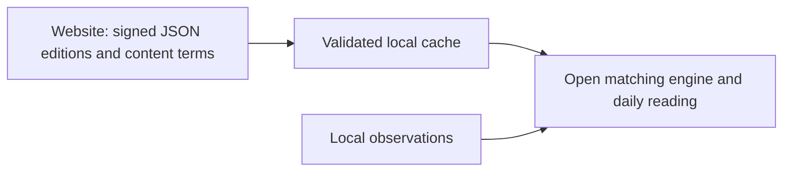

# Open application and hosted editorial catalogs

The tool is free and open source. TeamLandi maintains the official editorial
JSON separately. No account, payment, or license key is introduced by this
separation.

## The boundary

| Location | Contents | Distribution |
| --- | --- | --- |
| App repository | Parsers, deterministic matching, local analysis/storage, UI, native shells, optional aggregate server | Apache-2.0 |
| Editorial process | Research, selection and review of each edition | Not part of this repository |
| Website | Approved JSON editions, content terms, public pages | Public static delivery |

The engine matches content to observations locally. Catalog downloads contain no
prompts, activity records, practice outcomes, or personal history. The host can
observe ordinary HTTP request metadata such as IP address and request time.
Optional aggregate sharing and provider wording remain separate disclosed flows.

Every channel's JSON structure is documented in [content formats](CONTENT_FORMATS.md)
and enforced by the closed parsers under `src/practicegraph/analysis/`. Public
editions are signed and encrypted; see [catalog encryption](CATALOG_ENCRYPTION.md).

## Client behavior

- The official default is `https://practicegraph.dev` (the apex redirects to
  `www.practicegraph.dev`). Set `PRACTICEGRAPH_CONTENT_BASE_URL` or
  `content_base_url` in `config.json` to use another compatible host/path.
  Explicit per-channel URLs win. The updater and aggregate server are separate
  configuration.
- News, builds, community, and profile-specific documentation/model catalogs use
  15-minute retry intervals. Benchmark models refresh daily. Editorial updates
  therefore need no application release.
- Downloads use bounded HTTPS transport with redirect protections. A failed or
  invalid refresh keeps the last valid local cache. Personal analysis remains
  available without the website.
- Accepted-source receipts are bound to the cached content digest. Old caches
  without matching receipts show unknown provenance, regardless of today's
  configured URL. Receipt metadata is local provenance, not authentication.
- The UI identifies the source and editorial date and flags older editions.
  Review windows are 3 days for news, 7 for builds/community, 14 for model
  guidance, and 30 for docs. They are review prompts, not proof a fact is false.
  Repeated downloads never make an old edition fresh. Dates embedded in versions
  are not independently verified publication timestamps.
- Before a valid download, editorial shelves show an explicit empty state.
  No editorial edition is bundled in the runtime. Generic local practices and
  fallback numerical rate cards remain engine support.

## Rights and publication

The website's `CONTENT_LICENSE.txt` proposes free personal/internal business use,
caching, display in the app and forks, and reasonable attributed excerpts. Bulk
republication of TeamLandi's original collection requires separate permission,
subject to law and prior grants. These are content terms, not restrictions on
the Apache application. Forks can point the app at other compatible catalogs.

Hosting public JSON does not establish ownership of facts, benchmark
measurements, linked articles, or repository code. Original editorial selection
and arrangement may receive protection; the underlying material keeps its own
rights. See the [US Copyright Office on compilations](https://www.copyright.gov/register/tx-compilations.html)
and [databases](https://www.copyright.gov/register/tx-databases.html).
[Apache-2.0](https://www.apache.org/licenses/LICENSE-2.0.html) grants perpetual,
irrevocable copyright permissions for the application subject to its terms.
Public tests use synthetic catalog fixtures only.
