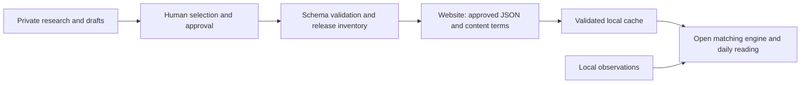

# Open application and hosted editorial catalogs

Owner decision, September 5, 2026: the tool is free and open source. TeamLandi
maintains the official editorial JSON separately. No account, payment, or license
key is introduced by this separation.

## The boundary

| Location | Contents | Distribution |
| --- | --- | --- |
| App repository | Parsers, deterministic matching, local analysis/storage, UI, native shells, optional aggregate server, generic authoring utilities | Apache-2.0 |
| Private editorial workspace | Candidates, drafts, review notes, selections, source checks, immutable release archive | Keep private |
| Website | Approved JSON editions, manifest, content terms, public pages | Public static delivery |



The engine matches content to observations locally. Catalog downloads contain no
prompts, activity records, practice outcomes, or personal history. The host can
observe ordinary HTTP request metadata such as IP address and request time.
Optional aggregate sharing and provider wording remain separate disclosed flows.

Skills can now produce signed, encrypted catalog editions, and the client can
read them before the normal schema/cache checks. The reader key is recoverable;
this is modest scraping deterrence, not protection from the recipient. The
separate publisher signing key remains private. No extra gateway, installation
registration or key-fetch request is introduced. Plaintext feeds and custom
hosts remain compatible. Existing production channels have not been switched;
the compatible client must be released first. See [catalog encryption](CATALOG_ENCRYPTION.md).
The optional [training channel](TRAINING.md) follows the same pipeline and matches
explicit learning goals locally.

Maintainer defaults use sibling `../practicegraph-site/editorial`, in the existing
private repository. `PRACTICEGRAPH_EDITORIAL_DIR` selects another private location
outside the app. The existing website worktree is `../practicegraph.dev`.

## Catalog contract and delivery

`src/practicegraph/content.py` is the shared registry of closed production parsers,
version fields, and editorial review windows. New content remains data, never
executable instructions. The `harness-playbooks` channel supplies reviewed setup
guidance authored through a Codex skill; its client recipes and inspection scope
remain in the open engine. See [the playbook contract and workflow](HARNESS_PLAYBOOKS.md).
Repository selections live in `build-ideas.json`'s `repos`
field. Models, news, documentation, community, advisor, rate cards, and skills have
their existing independent channels. Documentation and model catalogs have
`-productivity.json` variants with separate downloads and caches.

After the channel workflow prepares the authorized JSON, run from the app tree:

```powershell
.venv/Scripts/python.exe -m tools.content_release prepare --site ../practicegraph.dev --archive ../practicegraph-site/editorial/releases
.venv/Scripts/python.exe -m tools.content_release check --site ../practicegraph.dev
```

The release gate rejects malformed catalogs, unexpected public JSON, oversized
artifacts, private editorial directories, and changed bytes reusing an edition
version. It preserves versioned copies privately and writes `catalog-manifest.json`
with exact SHA-256 values, versions, edition dates, and content-term metadata.
JSON is normalized to LF before archival; repository attributes preserve those
bytes across Windows and the hosted Linux checkout.
An archive entry records prepared bytes; it does not certify approval or deployment.

Commit the changed channel files and manifest together when Git delivery is
authorized. Verify both on the live host after deployment. Rollback restores an
approved archived edition and regenerates the manifest in the same site commit.
The existing news selection still authorizes its full delivery workflow; model
and build workflows retain their separate Git authorization requirements.

The manifest is an operational inventory. The current app downloads and validates
channel URLs directly; it does not fetch or authenticate this manifest. Hashes
are not signatures. Schema extensions still require a compatible client release
before publishing fields older strict parsers will reject.

## Client behavior

- The official default remains `https://practicegraph-dev.vercel.app` until domain
  cutover. Set `PRACTICEGRAPH_CONTENT_BASE_URL` or `content_base_url` in `config.json`
  to use another compatible host/path. Explicit per-channel URLs win. A base
  override includes skills; the unchanged default skills source is its separate
  registry. The updater and aggregate server are separate configuration.
- News, builds, community, and profile-specific documentation/model catalogs use
  15-minute retry intervals. Benchmark models refresh daily. Editorial updates
  therefore need no application release.
- Downloads retain existing bounded HTTPS transport and redirect protections.
  A failed or invalid refresh keeps the last valid local cache. Personal analysis
  remains available without the website.
- Accepted-source receipts are bound to the cached content digest. Old caches
  without matching receipts show unknown provenance, regardless of today's
  configured URL. Receipt metadata is local provenance, not authentication.
- The UI identifies the source and editorial date and flags older editions.
  Review windows are 3 days for news, 7 for builds/community, 14 for model
  guidance, and 30 for docs. They are review prompts, not proof a fact is false.
  Repeated downloads never make an old edition fresh. Dates embedded in versions
  are not independently verified publication timestamps.
- Before a valid download, editorial shelves show an explicit empty state.
  Historical model, documentation, and build/repository bundles are no longer
  shipped in the runtime. Their existing Apache test copies remain reusable.
  Generic local practices and fallback numerical rate cards remain engine support.

## Rights and publication

The website's `CONTENT_LICENSE.txt` proposes free personal/internal business use,
caching, display in the app and forks, and reasonable attributed excerpts. Bulk
republication of TeamLandi's original collection requires separate permission,
subject to law and prior grants. These are content terms, not restrictions on
the Apache application. Forks can use other compatible catalogs.

Hosting public JSON does not prevent copying or establish ownership of facts,
benchmark measurements, linked articles, or repository code. Original editorial
selection and arrangement may receive protection; the underlying material keeps
its own rights. See the [US Copyright Office on compilations](https://www.copyright.gov/register/tx-compilations.html)
and [databases](https://www.copyright.gov/register/tx-databases.html). Actual
authorship and jurisdiction matter; preserve human review and attribution records.

Earlier rights remain available. [Apache-2.0](https://www.apache.org/licenses/LICENSE-2.0.html)
grants perpetual, irrevocable copyright permissions subject to its terms. Moving
historical Apache material into a different repository does not revoke those
permissions. Editorial quality, source relationships, and continued updates are
the practical advantage; public data is not a trade secret.

Removed drafts remain in old private Git history. Publish a clean source tree
using `tools/public_source.py` and its explicit inventory; do not publish the
private history. Public tests use synthetic catalog fixtures. Original fixture
bytes are preserved only in the private editorial migration archive. Export
exclusions do not clean old commits or previously created archives.

## Current delivery state

Maintainer skill coverage, synchronization, and the common draft validator are
documented in [editorial workflows](EDITORIAL_WORKFLOWS.md). The snapshot below
records the original architecture preparation; later private release reviews
identify proposed editions separately from verified production state.

Six existing website channels are inventoried locally. Community/advisor and the
productivity variants have not been newly approved or deployed. Historical
productivity documents remain private drafts with their old dates. The content
terms and deployment exclusions are staged locally. Earlier deployments may
still expose the removed `build-ideas-next.json` until replaced.

The earlier 0.2.0 MSI predates this work. Rebuild an installer from this validated
source before distributing the architecture change.

Validation: the full Python run had 949 passes and two failures, both corrected
and rechecked (the new asset needed Git staging; the pinning test now supplies a
downloaded catalog). The 50-test affected server/content/asset run passed, as did
the later 14-test content/asset run including Windows newline portability. All
88 UI tests, the production UI build, Ruff, and strict mypy passed. Five maintained
skills passed their format validator. Browser review used synthetic activity and
local copies of the website catalogs, with source attribution, stale/empty states,
and authenticated reload verified. No live content, deployment, or installer was
changed by these checks.
